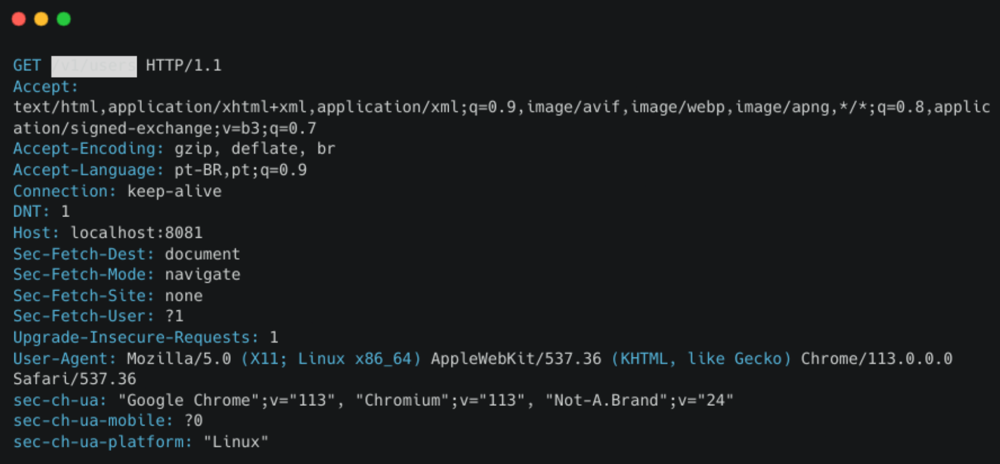
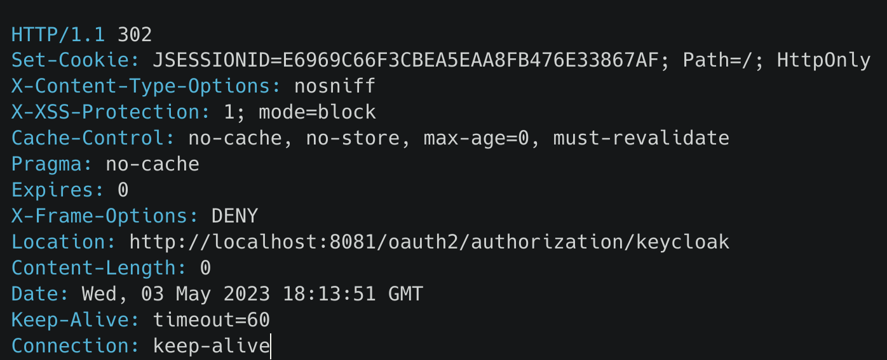
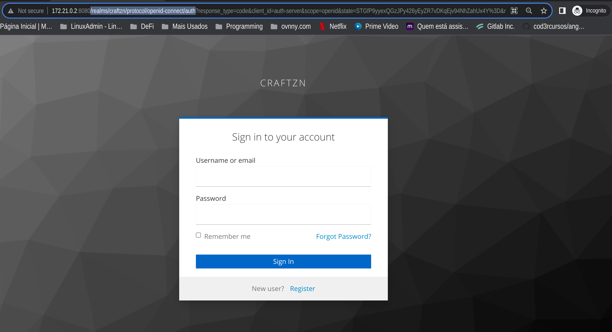
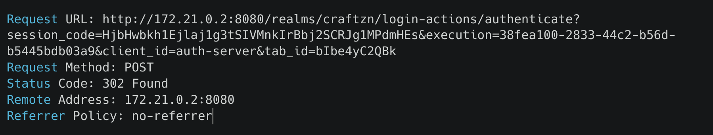
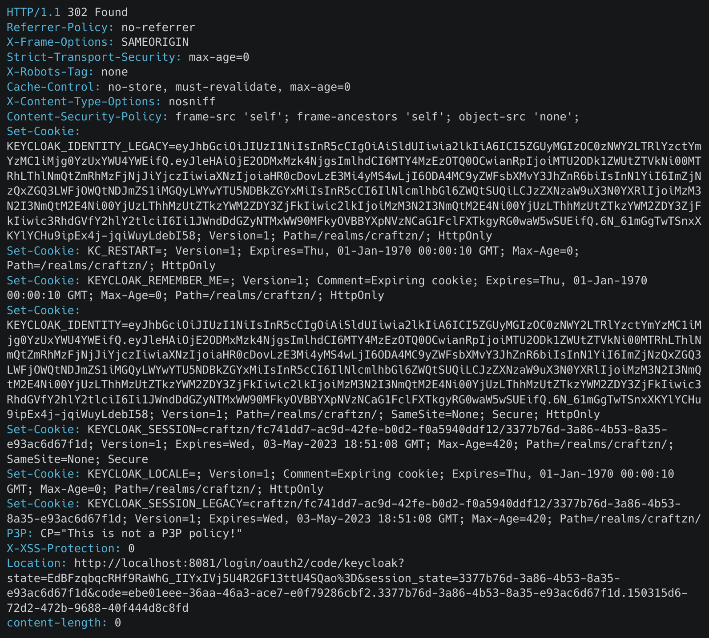
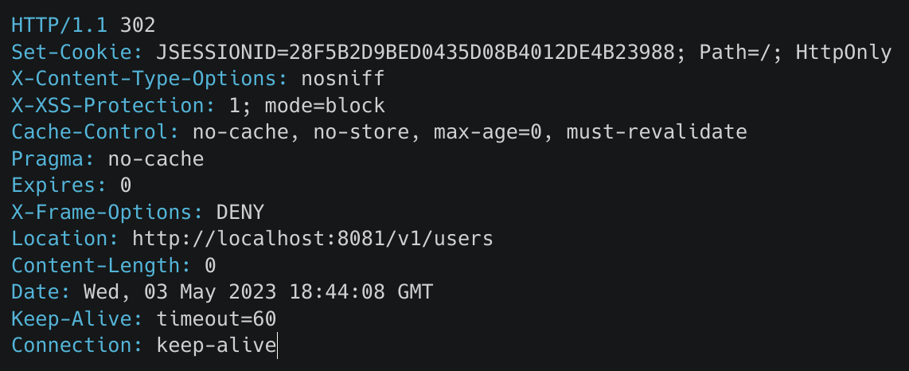
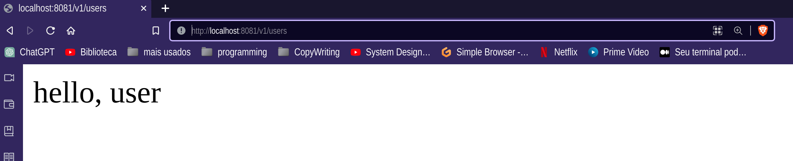

    export command = bin/kc.sh export --dir /opt/keycloak/realm-export --users realm_file
    files = craftzn-realm.json  master-realm.json
    import-directory = /opt/keycloak/data/import 

# auth-server

## Authentication Flow

- ### GET RESOURCES - {{resource-host}}/v1/users 200 
  - 
- ### REDIRECT CLIENT 302 {{resource-host}}/oauth2/authorization/keycloak
  - 
- ### GET FORM UI 200 {{issuer-host}}/realms/craftzn/protocol/openid-connect/auth 
  - 
- ### POST /realms/craftzn/login-actions/authenticate
  - 
- ### REDIRECT 300 FOUND {{resource-host}}/login/oauth2/code/keycloak
  - 
- ### GET RESOURCES 200 {{resource-host}}/v1/users
  - 
- ### RESPONSE 200 OK
  - 