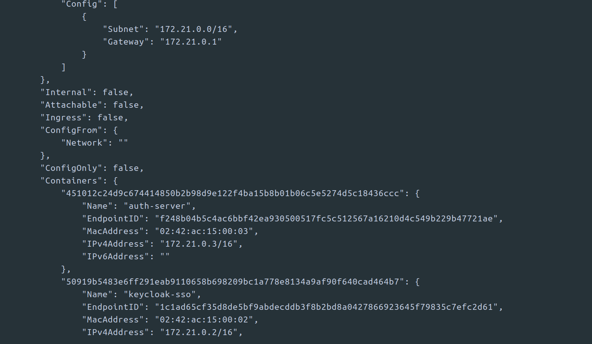

# auth-server
Dedicated to provide authentication services using Keycloak as Identification and Access Provider (IAM) using OpenId Connect and Oauth2

- **Docker host Subnet** = 172.21.0.0/16
- **Gateway** = 172.21.0.1
- **keycloack-sso IP** = 172.21.0.2
- **auth-server IP** = 172.21.0.3

___

